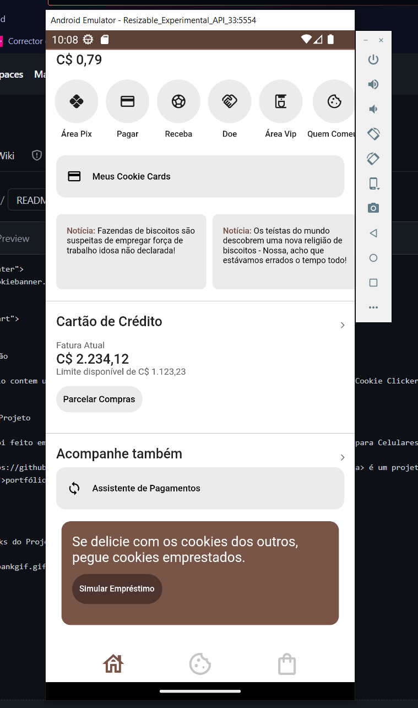

## 🤗 Introdução

Esse repositório contem um **UI/UX** Clone do Aplicativo Mobile do **Nubank** com o tema do [Cookie Clicker](https://orteil.dashnet.org/cookieclicker/).

## ⚔️ Sobre o Projeto

Esse projeto foi feito em <a href="https://flutter.dev" target="_blank">Flutter</a> com foco para Celulares.   

O <a href="https://github.com/amoreira2003/Nubank-FlutterClone" target="_blank">Cookie Bank</a> é um projeto para meu <a href="https://github.com/amoreira2003" target="_blank">portfólio</a> de **Front-End**

  

              
